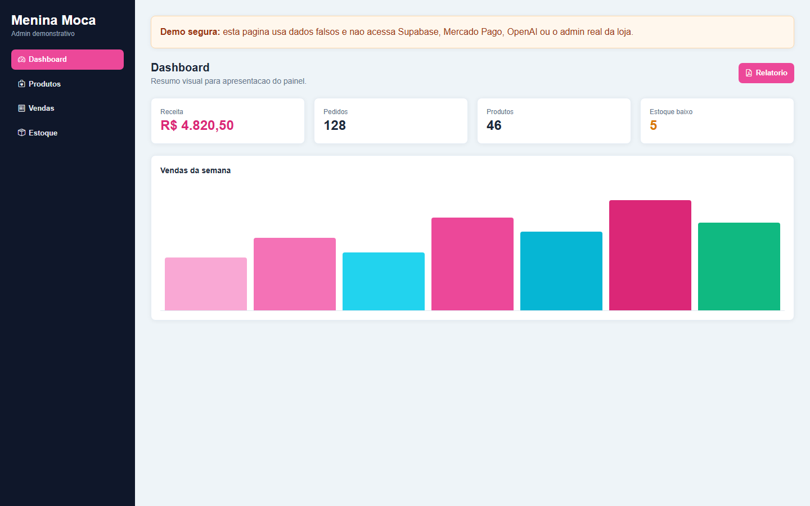

# Menina Moça Makeup

Loja online de maquiagem e cosméticos com vitrine responsiva, carrinho, checkout pelo Mercado Pago, envio de pedidos pelo WhatsApp e painel administrativo para gerir catálogo, estoque e vendas.

**Loja no ar:** https://mmm-makeup.onrender.com

**Demonstração do painel admin (dados fictícios):** https://mmm-makeup.onrender.com/admin-demo.html

> A hospedagem usa o plano gratuito do Render, então o primeiro acesso pode levar alguns segundos enquanto o servidor acorda.

## Telas

| Vitrine | Categorias |
| --- | --- |
|  |  |

| Painel administrativo (demo) | Mobile |
| --- | --- |
|  |  |

## Funcionalidades

- Vitrine pública com categorias, subcategorias, destaques e promoções.
- Carrinho com controle de quantidade e variações de produto.
- Checkout com cartão de crédito e débito pelo Mercado Pago.
- Pedidos com PIX ou dinheiro encaminhados para o WhatsApp da loja.
- Retorno de pagamento com confirmação da venda e baixa automática de estoque.
- Painel administrativo responsivo para produtos, categorias, estoque, vendas, usuários e relatórios.
- Cadastro de produtos com código de barras, foto, tons, cores, tamanho, volume, acabamento, cobertura e tipo de pele.
- Controle de estoque com histórico de movimentações e alertas de estoque baixo.
- Melhoria de fotos de produto com IA no painel admin.

## Tecnologias

| Camada | Tecnologia |
| --- | --- |
| Frontend | HTML, CSS e JavaScript puro |
| Backend | Node.js, Express |
| Banco e autenticação | Supabase (PostgreSQL, Auth e Row Level Security) |
| Pagamentos | Mercado Pago Checkout Pro |
| Integrações | WhatsApp, OpenAI Images |
| Deploy | Render |

## Como rodar localmente

Pré-requisitos: Node.js 18 ou superior e um projeto no [Supabase](https://supabase.com).

1. Clone o repositório e instale as dependências do backend:

   ```bash
   git clone https://github.com/falcao27/mmmMakeup.git
   cd mmmMakeup/backend
   npm install
   ```

2. Crie o banco executando [`sql/schema_completo.sql`](sql/schema_completo.sql) no SQL Editor do Supabase.

3. Crie o arquivo de configuração e preencha com as chaves do seu projeto:

   ```bash
   # Windows
   copy .env.example .env
   # Linux/macOS
   cp .env.example .env
   ```

4. Aponte o frontend para o seu projeto: troque a URL e a chave pública (`anon`) do Supabase em `frontend/script.js`, `frontend/auth.js` e `frontend/admin.html`.

5. Crie o primeiro administrador (usa `ADMIN_EMAIL` e `ADMIN_PASSWORD` do `.env`) e inicie o servidor:

   ```bash
   npm run setup
   npm start
   ```

A loja abre em http://localhost:3000 e o painel em http://localhost:3000/admin.html. O backend Express serve a API e também os arquivos do frontend.

## Variáveis de ambiente

Todas estão descritas em [`backend/.env.example`](backend/.env.example). O arquivo `.env` real nunca é versionado.

| Variável | Para que serve |
| --- | --- |
| `SUPABASE_URL`, `SUPABASE_SERVICE_ROLE_KEY` | Acesso administrativo ao banco, usado só no backend |
| `MERCADO_PAGO_*` | Credenciais do checkout |
| `WHATSAPP_PHONE` | Número que recebe os pedidos |
| `OPENAI_API_KEY`, `OPENAI_IMAGE_MODEL` | Melhoria de fotos (opcional) |
| `APP_URL`, `API_URL`, `ALLOWED_ORIGINS` | URLs de retorno do pagamento e CORS |
| `ADMIN_EMAIL`, `ADMIN_PASSWORD` | Criação do primeiro admin pelo `npm run setup` |

## Segurança

- Chaves sensíveis ficam apenas no backend, em variáveis de ambiente.
- A chave do Supabase que aparece no frontend é a pública (`anon`); o acesso aos dados é limitado pelas políticas de RLS.
- Rotas administrativas exigem token do Supabase e perfil de administrador; rotas de checkout exigem usuário autenticado.
- CORS restrito às origens configuradas e cabeçalhos básicos de segurança nas respostas.
- Textos exibidos na loja são escapados para reduzir o risco de XSS.

## Estrutura

```text
backend/   API Express: checkout, rotas administrativas e integrações
frontend/  Loja, painel admin e páginas de retorno de pagamento
sql/       Schema, políticas RLS e ajustes de banco
docs/      Demo estática do painel admin e prints
```

## Autor

Desenvolvido por [Jefferson Falcão](https://github.com/falcao27).
